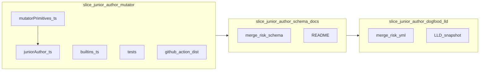

# Mutators: shallow vertical slices and branches

## Context (repo state)

- [`core/types.ts`](core/types.ts): `Mutator.apply(context, options) => number | null` (positive multiplier, or skip).
- [`core/scorer.ts`](core/scorer.ts): applies mutators after weighted sum; sorts by id for deterministic `mutatorsApplied`; [`scoreWithRegistries`](core/scorer.ts) exists for tests.
- [`core/mutators/builtins.ts`](core/mutators/builtins.ts): registers **`junior_author`** and **`critical_service`**. Shared glob logic for services lives in [`core/serviceCatalog/globMatchForServices.ts`](core/serviceCatalog/globMatchForServices.ts) (used by `service_criticality` and `critical_service`).
- [`schema/merge-risk-config.schema.json`](schema/merge-risk-config.schema.json): conditional validation for **`mutators.junior_author.options`**; other mutator keys remain permissive until their slices land.
- CI: any slice that touches TS imports must run `npm run build:github-action` and commit [`extensions/github-action/dist/`](extensions/github-action/dist/) so [`ci.yml`](.github/workflows/ci.yml) ncc drift check passes.

**Sync:** If `git pull origin main` fails locally (e.g. SSH), rebase this work onto latest `main` before opening or merging PRs so CI and history match the remote.

## Progress checklist

**`junior_author`:** [x] slice 1 mutator [x] slice 2 schema [x] slice 3 dogfood/LLD

**`critical_service`:** [x] slice 4 core (`slice/critical-service-mutator`) — [ ] slice 5 schema/docs — [ ] slice 6 dogfood/LLD

## Shared mutator pattern (DRY, one way to build “multiplier if condition”)

Both shipped mutators are the same **shape**: *if* some pure predicate on `PRContext` + typed options, *then* multiply the running score by a configured `multiplier` (`> 1`); else return `null`. Differences are only **how** `applies` is computed (author set vs service catalog match).

**Single abstraction (ships in the first core slice, not a separate “framework” branch):**

- Add [`core/mutators/mutatorPrimitives.ts`](core/mutators/mutatorPrimitives.ts) (name can be adjusted, but keep **one** home for cross-mutator mechanics) containing:
  - **`readExclusiveMinimumOneMultiplier(options: unknown): number | null`** — reads `multiplier` from validated YAML shape defensively (schema remains source of truth; this avoids duplicating parse/clamp rules in every mutator file).
  - **`createConditionalMultiplierMutator(spec)`** — returns a [`Mutator`](core/types.ts) with `name` and `apply` implemented as: if `spec.applies(context, options)` then return the multiplier from options (non-null), else `null`. Keeps each concrete mutator file to **predicate + types + display name** only.

**Concrete mutators stay thin:**

- [`juniorAuthor.ts`](core/mutators/juniorAuthor.ts): `applies` = author login in configured `logins` (case-insensitive, trimmed); options type in `juniorAuthor.types.ts`.
- [`criticalService.ts`](core/mutators/criticalService.ts): `applies` = any `context.files` path matches at least one of `service_ids` against merged `services` globs; options type in `criticalService.types.ts`; scorer merges `services` before `apply` (same idea as `mergeOptionsForCriterionEvaluation` for `service_criticality`).

**Service path matching:** If `criticalService` would duplicate the micromatch / catalog walk from [`serviceCriticality.ts`](core/criteria/serviceCriticality.ts), extract a **pure** helper into a neutral module (e.g. `core/serviceCatalog/matchChangedFilesToServices.ts` or a `serviceCriticalityMatch.ts` sibling) that **both** the criterion and the mutator import—criteria must not import mutators; mutators may import a shared catalog matcher. Do this extraction in the `critical_service` core slice only if the diff is small; otherwise document “intentional parallel” and extract in a follow-up.

**What we deliberately do *not* do:** a heavy plugin-style mutator registry framework, or dynamic loading—only two built-ins plus the existing `builtInMutators` map.

## Product / YAML naming

| LLD filename | YAML id (registry key) | Rationale |
|--------------|------------------------|-----------|
| `juniorAuthor.ts` | `junior_author` | Matches criterion style (`author_seniority`, snake_case keys). |
| `criticalService.ts` | `critical_service` | Matches [ADR 0009](docs/adrs/0009-service-criticality-criterion-config.md) prose (“`critical_service` mutator”). |

## Mutator 1: `junior_author` (ship first—no scorer merge hook)

**Behavior:** If `PRContext.author` (login string) is in a configured set (case-insensitive, trimmed), return a configurable multiplier `> 1`; otherwise `null`. Pure over context; aligns with ADR 0004.

**MVP options shape (implement in slice 1; validate in slice 2):**

- `logins`: string array (min length 1 after validation), each non-empty.
- `multiplier`: number, `exclusiveMinimum: 1` (strictly multiplicative bump).

**Files:** [`core/mutators/mutatorPrimitives.ts`](core/mutators/mutatorPrimitives.ts) + [`test/mutatorPrimitives.test.ts`](test/mutatorPrimitives.test.ts) (factory + multiplier edge cases); [`core/mutators/juniorAuthor.ts`](core/mutators/juniorAuthor.ts) + [`core/mutators/juniorAuthor.types.ts`](core/mutators/juniorAuthor.types.ts) (thin `createConditionalMultiplierMutator` usage); register in [`core/mutators/builtins.ts`](core/mutators/builtins.ts); [`test/juniorAuthorMutator.test.ts`](test/juniorAuthorMutator.test.ts). Optional: one [`test/scorer.test.ts`](test/scorer.test.ts) case with real `score()` + builtins to prove registry wiring.

**Branches (sequential from `main`):**

1. **`slice/junior-author-mutator`** — **Primitives +** `junior_author` + `builtins.ts` + tests + `npm run build:github-action` + committed `dist/`. **Done.**
2. **`slice/junior-author-schema-docs`** — JSON Schema `allOf` branch: when `mutators` contains `junior_author`, validate `options` (`logins`, `multiplier`); extend [`test/config.test.ts`](test/config.test.ts); document in [`README.md`](README.md); rebuild `dist/` if needed. **Done.**
3. **`slice/junior-author-dogfood-lld`** — Optional [`.merge-risk.yml`](.merge-risk.yml) entry (conservative multiplier, small login set or empty skip until you want noise); update [`docs/designs/lld-merge-risk-classifier.md`](docs/designs/lld-merge-risk-classifier.md) Brindle snapshot (mutators section + tree); `dist/` if touched. **Done** (dogfood `mutators.junior_author` for Dependabot / `github-actions[bot]`; no TS change in this slice so dist unchanged).

## Mutator 2: `critical_service` (second—requires scorer merge of `services`)

**Behavior:** If any changed file matches **any** of the configured “critical” logical services (using the same **root `services`** catalog and micromatch semantics as [`core/criteria/serviceCriticality.ts`](core/criteria/serviceCriticality.ts)), return a multiplier `> 1`; else `null`. Reuses ADR 0009 catalog without duplicating globs in mutator options.

**Scorer change:** Add a sibling of `mergeOptionsForCriterionEvaluation` in [`core/scorer.ts`](core/scorer.ts)—e.g. `mergeOptionsForMutatorApplication(mutatorId, config, options)`—that merges `config.services` into `options` **only** for mutator id `critical_service` (mirror the `service_criticality` criterion special-case). Keeps mutator `apply` pure and keeps services on root YAML per ADR 0001.

**MVP options shape:**

- `service_ids`: non-empty string array (which catalog entries count as “critical” for this mutator).
- `multiplier`: number, `exclusiveMinimum: 1`.

**Files:** [`core/mutators/criticalService.ts`](core/mutators/criticalService.ts) + [`core/mutators/criticalService.types.ts`](core/mutators/criticalService.types.ts)—**reuse** `createConditionalMultiplierMutator` from `mutatorPrimitives.ts` (no second multiplier parser); register in `builtins.ts`; tests for `applies` / catalog behavior; scorer tests proving `services` merge path. Prefer shared catalog path-matching helper over copy-paste from `serviceCriticality` (see **Shared mutator pattern** above).

**Branches (sequential from `main` after mutator 1 work is merged):**

4. **`slice/critical-service-mutator`** — **Done** (scorer merge for `services` on `critical_service`, `criticalService.ts` + types, `globMatchForServices` extract, tests, `dist/`).
5. **`slice/critical-service-schema-docs`**
6. **`slice/critical-service-dogfood-lld`** — Dogfood only makes sense if [`.merge-risk.yml`](.merge-risk.yml) already has `services` + you want a mutator line; otherwise LLD-only slice 6 is still valid.

## Cross-cutting notes

- **Overlap with `author_seniority`:** `junior_author` multiplies after the weighted sum; teams may use both (additive criterion + multiplicative nudge)—document in README when to prefer which.
- **Unknown `service_ids`:** At runtime, ids missing from merged `services` contribute no matches (defensive); optionally document; schema could later add cross-key checks (non-goal for MVP).
- **Report:** [`core/report.ts`](core/report.ts) already lists `mutatorsApplied` ids—no change required for MVP unless you want human-readable mutator `name` in markdown later.

## Out of scope (separate work)

- Declarative rules / trusted plugins (LLD scorer step 1 remainder).
- Changing GitHub adapter or `PRContext` for mutators (not required for these two).
