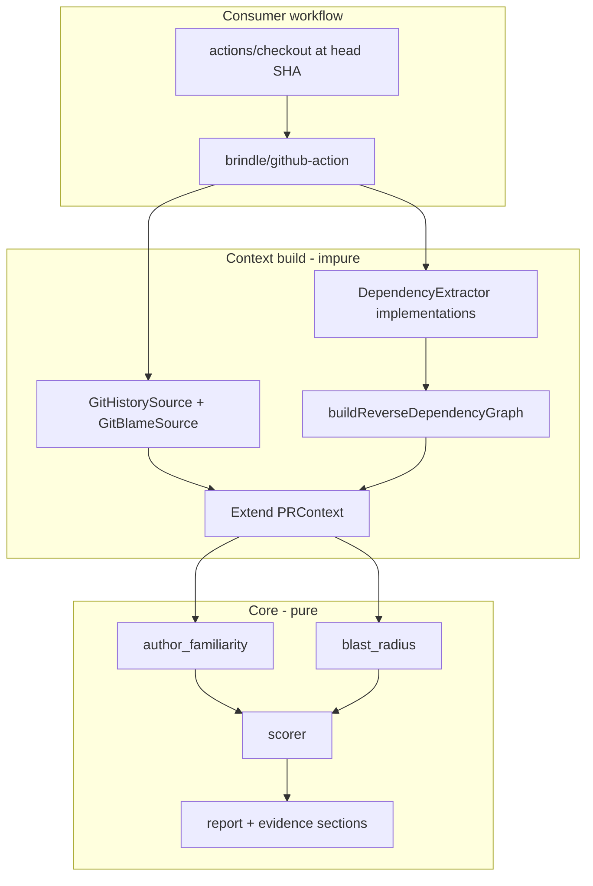

# Contextual evidence — product overview

## What this is

Brindle adds **contextual evidence** to merge-risk scoring: per changed file, how familiar the author was with that path **before this PR**, and how broadly the file is depended upon through static dependency edges. Findings feed two new weighted criteria (`author_familiarity`, `blast_radius`) and a detailed **Contextual evidence** section in the PR comment.

This is not a separate product. It extends the existing scorer, `PRContext`, and `RiskReport` described in [lld-merge-risk-classifier.md](lld-merge-risk-classifier.md).

## Validation provenance

The v2 evidence demo validated the explanation on real pull requests ([`v2/evidence-demo/VALIDATION.md`](../../../v2/evidence-demo/VALIDATION.md), 2026-06-17). Senior engineers accepted familiarity and JS/TS blast-radius copy as trustworthy and actionable.

The demo's **CLI is discarded**. The **analyzers**, **extractor architecture**, and **report assembly** lift into core. Implementation may land in slices; these LLDs describe **target product behavior**.

## Demo gaps corrected in product spec

The demo validated explanation *shape*, not every semantic detail. The product LLDs **require** these corrections — they are not deferred robustness work.

| Gap | Demo behavior | Product behavior |
| --- | --- | --- |
| Familiarity revision | Measured at PR head; PR commits inflate familiarity | All signals at **merge-base** (`baseRevision`); exclude `base..head` |
| First touch of legacy file | Often `moderate` (single PR commit) | **`none`** with pre-PR framing |
| Added files | `none` with 0% lines | **`high`** (greenfield gate by `changeKind: added`) |
| Moderate rule | `authorCommitCount ≥ 1` path | Requires **`authorCommitCount ≥ 2`** or line shares ≥ 10% |
| Graph builder | Monolithic `importGraphSource.ts` | **Pluggable extractors** ([lld-dependency-graph-extractors.md](lld-dependency-graph-extractors.md)) |
| `.sass` (indented) | Not parsed | **In product spec** via stylesheet extractor (postcss-sass or equivalent) |
| Familiarity robustness | Listed as out-of-scope | **Robustness table** in familiarity LLD with v1 behavior + limitations |

See [lld-author-familiarity-criterion.md](lld-author-familiarity-criterion.md) and [lld-dependency-graph-extractors.md](lld-dependency-graph-extractors.md) for full contracts.

## Scope

**In scope (this design set):**

- `author_familiarity` and `blast_radius` criteria with configurable weights and raw-score mapping
- Hydrated git history/blame and unified dependency graph on `PRContext`
- Evidence sections in PR comment markdown (collapsible)
- v1 extractors: `js_ts`, `stylesheet` (lift from demo, refactored behind port)
- v2 extractor **specifications**: `go`, `python`, `rust` (design now; implement in slices)

**Out of scope:**

- The other three Peter evidence items (public-interface touches, resemblance to clean merges, resemblance to reverts/incidents)
- Weighted reach (PageRank, entry-point detection)
- GitLab/Bitbucket hydration (GitHub first; `PRContext` and ports stay platform-neutral)

## Architecture



### Layering rules

| Layer | ADR | Responsibility |
| --- | --- | --- |
| Criteria + analyzers | [0004](../adrs/0004-pure-criteria-over-hydrated-context.md) | Pure functions over hydrated `PRContext` |
| Git sources + file walk | [0010](../adrs/0010-contextual-analysis-at-head.md) | Impure hydration at adapter/extension edge |
| Extractor implementations | Extractors LLD | Parse source text → edges; no scoring |
| Platform adapter | [0007](../adrs/0007-platform-adapter-boundary.md) | Checkout orchestration, author email resolution, merge into context |

Everything under `core/contextual/` is platform-agnostic and publishable with merge-risk-core.

## Hydration model

**Default:** read-only workflow checkout at PR **head** SHA + gated hydration in the GitHub extension.

Why checkout, not Contents API alone:

- `git blame` and `git log` at merge-base need a real git object database
- Full-repo static graph requires walking and reading many source files — impractical via per-file API calls

**ADR 0001:** Config and plugins still load from **base ref only**. Reading source at `headSha` for static analysis and git attribution is permitted under [ADR 0010](../adrs/0010-contextual-analysis-at-head.md) — it is not executing PR-head config or arbitrary code.

**Gating:** Hydration runs only when `criteria.author_familiarity` and/or `criteria.blast_radius` is enabled in base-branch `.merge-risk.yml` (same pattern as `coverage_report_path` + `test_coverage`).

**Author identity:** Familiarity queries use git **email**. `PRContext.author` remains GitHub **login**. Hydration resolves email(s) from the head commit author, GitHub noreply patterns, and optional config override.

### Consumer workflow (GitHub)

```yaml
jobs:
  risk-check:
    runs-on: ubuntu-latest
    steps:
      - uses: actions/checkout@v4
        with:
          ref: ${{ github.event.pull_request.head.sha }}
          fetch-depth: 0   # blame/history; document minimum if shallow is acceptable
      - uses: usebrindle/brindle/extensions/github-action@…
```

Document `fetch-depth` tradeoffs in the implementation guide: shallow clones may undercount history window for familiarity.

## Relationship to existing criteria

| Signal | Criterion | Source |
| --- | --- | --- |
| Login tier | `author_seniority` | Team-configured rules |
| File history | `author_familiarity` | Git at merge-base |
| Path globs | `file_patterns` | Config patterns |
| Static dependents | `blast_radius` | Unified dependency graph |

A senior engineer on an unfamiliar file is the motivating combination: low seniority risk tier **or** high familiarity risk — both may be enabled with independent weights.

## Document map

| LLD | Contents |
| --- | --- |
| [lld-author-familiarity-criterion.md](lld-author-familiarity-criterion.md) | Analyzer, criterion, merge-base, greenfield, robustness |
| [lld-dependency-graph-extractors.md](lld-dependency-graph-extractors.md) | Extractor port, registry, languages |
| [lld-blast-radius-criterion.md](lld-blast-radius-criterion.md) | Pure analyzer, criterion, aggregation |
| [lld-contextual-evidence-reporting.md](lld-contextual-evidence-reporting.md) | PR comment sections, copy, limitations |

## Design doc build order

1. ADR 0010 + this overview
2. Extractors LLD
3. Familiarity LLD
4. Blast-radius LLD
5. Reporting LLD
6. Update main LLD + docs hub

## Implementation build order (future code phase)

1. Extractor port + v1 `js_ts` / `stylesheet` refactor from demo
2. Familiarity with merge-base + greenfield (not demo semantics)
3. Blast-radius criterion + graph hydration
4. Report + JSON Schema slice
5. v2 extractors (`go`, `python`, `rust`) one at a time via registry

## Dependencies

- [lld-merge-risk-classifier.md](lld-merge-risk-classifier.md) — scorer, `PRContext`, reporting
- [ADR 0001](../adrs/0001-no-pr-head-execution.md), [ADR 0004](../adrs/0004-pure-criteria-over-hydrated-context.md), [ADR 0010](../adrs/0010-contextual-analysis-at-head.md)
- v2 demo source: [`v2/evidence-demo/src/`](../../../v2/evidence-demo/src/) (reference implementation, not product contract for familiarity semantics)
