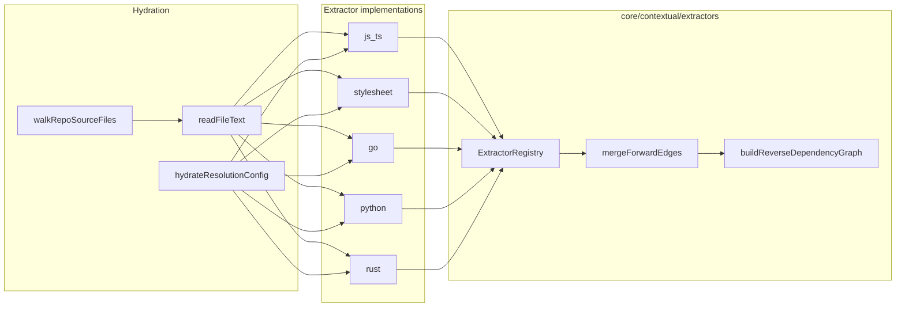

# Dependency graph extractors

## Purpose

Blast radius depends on a **reverse-dependency graph** of the repository: for each changed file, how many other files statically depend on it (directly and transitively). Different languages express dependencies differently. The product must support **JavaScript/TypeScript and stylesheets in v1**, and **Go, Python, and Rust in v2**, without rewriting the pure blast-radius analyzer each time.

This LLD defines the **extractor port** (hexagonal architecture): language-specific parsers live behind a common interface; they merge edges into one unified graph. The blast-radius analyzer in [lld-blast-radius-criterion.md](lld-blast-radius-criterion.md) consumes that graph and remains language-blind.

The v2 demo's monolithic [`importGraphSource.ts`](../../../v2/evidence-demo/src/inputs/importGraphSource.ts) is a **reference implementation** to refactor into v1 extractors — not the product shape.

## Design principles

1. **One unified graph** — all extractors write into the same reverse-dependency structure.
2. **Pure extractors at the edge** — `extractEdges` receives file text; no I/O inside extractors.
3. **Impure orchestration** — file walk, read text, hydrate resolution config, dispatch to extractors (adapter/extension).
4. **Honest limitations** — each extractor documents in-scope static forms and exclusions; merged into report limitations.
5. **Registry-driven capability** — changed files whose language has no enabled extractor appear in `notAnalyzedForBlastRadius` with an explicit reason, not silent zero reach.
6. **No scoring in extractors** — edges only.

This mirrors the coverage **format adapter** pattern ([`core/coverage/adapter.ts`](../../core/coverage/adapter.ts)): the scorer stays dumb; pluggable parsers live at the hydration boundary.

## Architecture



## Core types

```typescript
// core/contextual/extractors/types.ts (conceptual)

export type DependencyEdgeKind =
  | "static_import"
  | "static_require"
  | "stylesheet_import"
  | "stylesheet_use"
  | "stylesheet_forward"
  | "go_import"
  | "python_import"
  | "rust_mod"
  | "rust_use";

/** Forward edge: importer depends on target. */
export interface DependencyEdge {
  from: string;   // repo-relative importer path (normalized forward slashes)
  to: string;     // repo-relative resolved target path
  kind: DependencyEdgeKind;
}

export interface ExtractorContext {
  repoRoot: string;
  /** Per-ecosystem resolution hints hydrated once per run. */
  resolutionConfig: Readonly<Record<string, unknown>>;
}

export interface DependencyExtractor {
  /** Stable id, e.g. "js_ts", "stylesheet", "go". */
  readonly id: string;
  /** Extensions this extractor owns, lowercase with dot, e.g. ".tsx", ".scss". */
  readonly fileExtensions: readonly string[];
  /**
   * Extract unresolved specifiers from file text. Pure — no I/O.
   * Returns forward edges with `to` resolved where possible; omit edges when resolution fails.
   */
  extractEdges(
    filePath: string,
    fileText: string,
    context: ExtractorContext,
  ): readonly DependencyEdge[];
  /**
   * Resolve a module specifier from `fromFile` to a repo-relative path.
   * Returns null when static analysis cannot resolve reliably.
   */
  resolveSpecifier(
    fromFile: string,
    specifier: string,
    context: ExtractorContext,
  ): string | null;
}
```

### Reverse dependency graph

```typescript
/** target path → list of importer paths (one hop). Same contract as demo ImportGraph. */
export type ReverseDependencyGraph = ReadonlyMap<string, readonly string[]>;

/** Merge forward edges from all extractors; build reverse map. Pure. */
export function buildReverseDependencyGraph(
  edges: readonly DependencyEdge[],
): ReverseDependencyGraph;
```

Cycles, barrel re-exports, and cross-language edges are handled uniformly: the reverse map lists direct importers; transitive reach walks upward ([lld-blast-radius-criterion.md](lld-blast-radius-criterion.md)).

## Extractor registry

```typescript
// core/contextual/extractors/registry.ts (conceptual)

export interface ExtractorRegistry {
  /** All built-in extractors shipped with merge-risk-core. */
  readonly builtIns: readonly DependencyExtractor[];
  /** Lookup by id. */
  getById(id: string): DependencyExtractor | undefined;
  /** Lookup extractor responsible for a file path (by extension). */
  getForFile(filePath: string): DependencyExtractor | undefined;
}

/** Default v1-shipped ids when config omits enabled_extractors. */
export const DEFAULT_V1_EXTRACTOR_IDS = ["js_ts", "stylesheet"] as const;
```

Config ([lld-blast-radius-criterion.md](lld-blast-radius-criterion.md)) may restrict `enabled_extractors` to a subset. Disabled extractors:

- Do not run during hydration
- Changed files matching their extensions → `notAnalyzedForBlastRadius` with reason `extractor disabled: <id>` or `extractor not shipped: <id>`

## Resolution config hydration

Impure, once per run, before extractors run:

| Extractor | `resolutionConfig` keys (conceptual) | Source |
| --- | --- | --- |
| `js_ts` | `tsconfigPaths`, `baseUrl` | Root `tsconfig.json` or `jsconfig.json` |
| `stylesheet` | same as `js_ts` for aliased stylesheet imports | Root tsconfig/jsconfig |
| `go` | `modulePath` | `go.mod` module directive |
| `python` | `packageRoots` | `pyproject.toml`, `setup.cfg`, or heuristics |
| `rust` | `crateRoot` | `Cargo.toml` + workspace members |

Each extractor documents **in scope / out of scope** for resolution (same honesty model as v2 LLD 0002 path aliases).

## Language matrix

| Extractor id | Ship phase | Extensions | Static forms (in scope) |
| --- | --- | --- | --- |
| `js_ts` | **v1** | `.js`, `.jsx`, `.mjs`, `.cjs`, `.ts`, `.tsx`, `.mts`, `.cts` | ESM `import`, static `import()`, `export … from`; CommonJS `require('literal')` |
| `stylesheet` | **v1** | `.css`, `.scss`, `.sass` | `@import`, `@use`, `@forward` (quoted); `@import url('…')`; JS/TS imports of stylesheet paths |
| `go` | **v2** | `.go` | `import "path"` string literals; module-aware paths from `go.mod` |
| `python` | **v2** | `.py`, `.pyi` | `import x`, `from x import y` with literal module paths |
| `rust` | **v2** | `.rs` | `mod name;`, `use path::…` with resolvable paths |

Cross-language edges are first-class: e.g. `App.tsx` → `App.module.css` today; future static FFI/`cgo` where expressible.

## v1: `js_ts` extractor

Lift behavior from demo [`importGraphSource.ts`](../../../v2/evidence-demo/src/inputs/importGraphSource.ts):

- TypeScript compiler API with appropriate `ScriptKind` per extension
- Static ESM imports and static-literal `require()`
- Root tsconfig/jsconfig `paths` / `baseUrl` only

**Out of scope (limitation text):**

- Dynamic `require(variable)`, computed import paths, non-literal dynamic `import()`
- Bundler-only aliases not mirrored in root tsconfig
- Nested package tsconfigs in monorepos
- Platform resolution (SFCC cartridge paths, template includes)

## v1: `stylesheet` extractor

Lift from demo + **complete indented `.sass`** in product spec:

- `postcss` + `postcss-scss` for `.css` and `.scss`
- **`postcss-sass`** (or equivalent) for indented `.sass` — required in product; demo gap closed here
- Sass partial/index resolution (`_tokens.scss`, `index.scss`)
- Built-in `sass:*` modules: parse but **no graph edge** (not repo files)

**Out of scope (limitation text):**

- HTML `<link>`, CSS-in-JS, Vue/Svelte/Astro SFC embedded styles
- CSS modules `composes:` (class-level, not file path)
- Package/`node_modules` imports without root path config
- Less, Stylus, PostCSS build-time injection invisible in source

## v2: `go` extractor (specified, implement in slice)

- Parse `import` declarations with string literal paths
- Resolve using `go.mod` module path + relative layout
- **Out of scope:** cgo dynamic loading, `embed`, build tags excluding files without static signal, generated protobuf imports from paths outside module

## v2: `python` extractor (specified, implement in slice)

- AST or regex-safe extraction of literal `import` / `from … import`
- Resolve relative imports within package roots
- **Out of scope:** dynamic `__import__`, runtime path manipulation, namespace packages without static file mapping

## v2: `rust` extractor (specified, implement in slice)

- `mod foo;` → resolve `foo.rs` / `foo/mod.rs`
- `use crate::…`, `use super::…`, external crates when mappable to workspace path
- **Out of scope:** macro-generated modules, proc-macro re-exports, build.rs generated code

## Hydration orchestration

Impure module (GitHub extension or `adapters/github/contextual/dependencyGraphHydration.ts`):

```typescript
export interface BuildDependencyGraphInput {
  repoRoot: string;
  enabledExtractorIds: readonly string[];
  registry: ExtractorRegistry;
}

export interface BuildDependencyGraphResult {
  graph: ReverseDependencyGraph;
  enabledExtractors: readonly string[];
  limitations: readonly string[];  // per-extractor merged
}
```

Algorithm:

1. Hydrate `resolutionConfig` for enabled extractors
2. Walk repo (respect `.gitignore`? **v1:** walk all tracked files via `git ls-files` at head; document performance)
3. For each file, select extractor by extension; read text; call `extractEdges`
4. Merge all forward edges; `buildReverseDependencyGraph`
5. Collect limitation strings from each enabled extractor's static list

**Performance note:** Full-repo walk is acceptable for v1 GitHub Action targets (typical app repos). Monorepo / huge repos may need future incremental or path-filtered walks — note in overview LLD, not blocking v1.

## `notAnalyzedForBlastRadius`

A changed file is listed when:

- No extractor registered for its extension
- Extractor exists but is not in `enabled_extractors`
- File is binary or unreadable (optional skip with reason)

Changed files **with** a finding are never listed here. This replaces the demo's hard-coded `isAnalyzableSourceFile` extension check.

## Testing strategy

- **Unit:** each extractor against fixture file pairs (edges in/out)
- **Unit:** `buildReverseDependencyGraph` — cycles, cross-language chain, partial resolution
- **Unit:** registry lookup by extension and id
- **Integration:** hydration against small fixture repos (git tracked)
- **No platform** in extractor unit tests

## Dependencies

- [lld-blast-radius-criterion.md](lld-blast-radius-criterion.md) — consumes `ReverseDependencyGraph`
- [lld-contextual-evidence-reporting.md](lld-contextual-evidence-reporting.md) — per-extractor limitations in report
- v2 demo [`importGraphSource.ts`](../../../v2/evidence-demo/src/inputs/importGraphSource.ts) — v1 behavior reference

## Module layout (target)

```
core/contextual/extractors/
  types.ts
  registry.ts
  buildReverseDependencyGraph.ts
  builtins.ts              # registers js_ts, stylesheet, (later go, python, rust)
  jsTsExtractor.ts           # v1 — or under implementations/
  stylesheetExtractor.ts     # v1
adapters/github/contextual/  # or extensions/github-action/contextual/
  hydrateDependencyGraph.ts
  hydrateResolutionConfig.ts
```

Pure extractor modules may live in core; they must not import Node fs or platform SDKs. File walk stays impure.
