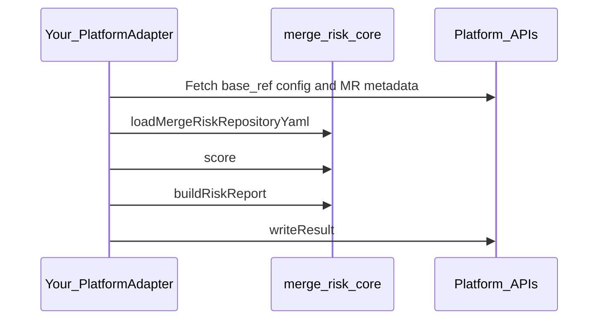

# Programmatic use (`@usebrindle/merge-risk-core`)

This page is for **embedding** Brindle’s deterministic merge-risk engine in your own Node.js tooling (custom runners, internal services, or a future GitLab/Bitbucket adapter you maintain). End users who only want GitHub should use the [GitHub Action](reference/action-inputs.md) instead.

## Install

```bash
npm install @usebrindle/merge-risk-core ajv js-yaml micromatch
```

`ajv`, `js-yaml`, and `micromatch` are **peer dependencies** of the published package; install compatible versions alongside it (see [packages/merge-risk-core/package.json](../packages/merge-risk-core/package.json) `peerDependencies`).

## Node.js versions

- **Package `engines`:** `node >= 20` (see `packages/merge-risk-core/package.json`).
- **Brindle monorepo** root `engines` may require a newer Node for contributors (see root [package.json](../package.json)); that does not change the published package floor.
- **Tag publish workflow** (`.github/workflows/publish-merge-risk-core.yml`) uses **Node 20**; **main CI** uses **Node 24**. All are within the package’s supported range.

## Public API and semver

The supported surface is the **runtime exports** and **TypeScript types** shipped from the package entry (`@usebrindle/merge-risk-core`). A **Vitest allowlist** in [test/merge-risk-core-public-api.test.ts](../test/merge-risk-core-public-api.test.ts) guards runtime export names; intentional additions or removals should update that test and this doc.

Notable exports:

| Area | Symbols (representative) |
| --- | --- |
| Scoring | `score`, `scoreWithRegistries` |
| Config | `loadScoringConfigFromMergeRiskYaml`, `loadMergeRiskRepositoryYaml`, `parseMergeRiskYamlDocument`, `assertValidScoringConfig`, `MergeRiskConfigError` |
| Report | `buildRiskReport`, `buildMergeRiskCommentMarkdown`, `checkConclusionForTier` |
| Coverage | `parseCoverageArtifactText`, `parseIstanbulCoverageJson`, `IstanbulCoverageParseError` |
| Version | `BRINDLE_VERSION` |
| Types | `PRContext`, `ScoringConfig`, `RiskReport`, `ScoreResult`, `PlatformAdapter`, … (see generated `dist/index.d.ts` after `npm run build:merge-risk-core`) |

**`PlatformAdapter`** is the seam for platform-specific I/O ([ADR 0007](adrs/0007-platform-adapter-boundary.md)). The npm package includes **only the interface type**, not GitHub/GitLab clients.

## Security: config and plugins from the base ref

The engine assumes **YAML and trusted plugin definitions** are loaded from the **change-request base** (or equivalent trusted ref), never from the contributor’s head where forks could substitute rules. See [ADR 0001](adrs/0001-no-pr-head-execution.md). Your adapter is responsible for fetching the right ref before calling `loadScoringConfigFromMergeRiskYaml` / trusted-plugin resolution.

## Minimal integration flow

1. Implement **`PlatformAdapter`**: `buildContext`, `writeResult`, `enableAutoMerge`.
2. In `buildContext`, populate a neutral **`PRContext`** and load **`.merge-risk.yml`** text from the **base** ref; pass YAML into `loadMergeRiskRepositoryYaml` / `loadScoringConfigFromMergeRiskYaml`.
3. Call **`score(context, scoringConfig)`** (and trusted-plugin wiring if you support it, matching the GitHub Action’s base-ref-only fetch rules).
4. Call **`buildRiskReport`** (and related helpers) to obtain markdown and check policy metadata.
5. Map **`RiskReport`** to your platform (MR note, pipeline status, etc.).



## Non-goals (this package)

- No **`GitHubAdapter`**, Octokit, `@actions/*`, or other CI SDKs.
- No hosted analytics or SaaS; those are separate products ([ADR 0008](adrs/0008-packaging-and-open-core.md)).

## Further reading

- [Low-level design](designs/lld-merge-risk-classifier.md) — engine and adapter layering.
- [Package README](../packages/merge-risk-core/README.md) — build from monorepo root, tagging for npm release.
- [Root README npm section](../README.md#npm-package-programmatic-use) — release tagging convention.
